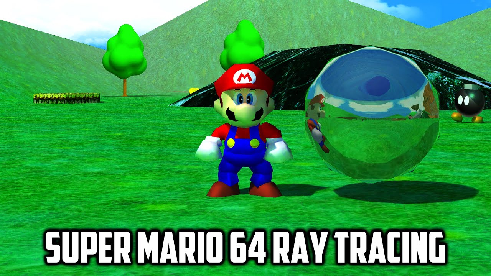
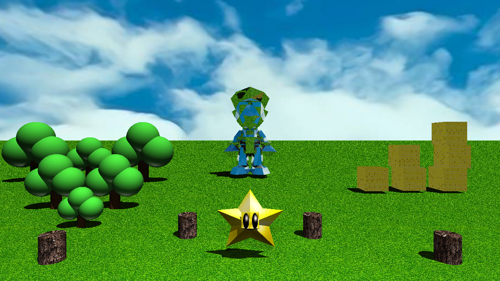

# Proyecto II — Gráficas por Computadora

**Universidad del Valle de Guatemala**  
André Emilio Pivaral López

---

## Descripción

Este proyecto consiste en el desarrollo de un Ray Tracer escrito en Python. Renderiza una escena inspirada en la estética del icónico videojuego de Nintendo, Super Mario 64.

Esta idea surgió al ver un video del videojuego modificado para renderizar con Ray Tracing. A pesar de que la geometría original del videojuego es bastante simple, el renderizado hacía que se viera realista. 

Este proyecto me planteó el desafío de recrear esa estética, con los conocimientos adquiridos en el módulo del curso; cumpliendo con los requisitos de ponderación del proyecto. Además, al ser mi videojuego favorito, la motivación por cuidar los detalles y entregar una escena de calidad fue personal.

El programa soporta materiales opacos, reflectivos, texturizados; manejo de luz ambiental, direccional y puntual; sombras y carga de modelos OBJ.

---

## Escena

Esta escena está compuesta por los siguientes elementos:

* **6 Árboles:**
    * En donde cada árbol está compuesto por el tronco (1 cilindro) y las hojas (3 esferas).
* **6 Bloques:**
    * Representados por figuras AABB con textura de ladrillo amarillo.
* **4 Pilares:**
    * Representados por cilindros con texturas de madera.
* **Suelo:**
    * Modelado por 1 plano infinito con textura de pasto.
* **Modelos OBJ:**
    * **Mario:** Modelo cargado mediante triángulos, utilizando un material altamente reflectivo que simula el metal.
    * **Star:** Modelo cargado mediante triángulos con las texturas originales.
* **Texturas:**
    * `sky.jpg` (Environment Map)
    * `grass.jpg`
    * `block.jpg`
    * `wood.jpg`
* **Materiales:**
    * Se definieron 7 materiales distintos para componer la escena, abarcando diferentes propiedades ópticas:
        * 3 Materiales Texturizados
        * 3 Materiales Opacos
        * 1 Material Reflectivo

---

## Resultados

A la izquierda se muestra la imagen de referencia. A la derecha, el render final obtenido con el Ray Tracer:

| Imagen Referencia | Render Final |
| :---: | :---: |
|  |  |

---

## Enlace Repositorio

Branch: Proyecto2  
<https://github.com/ihatethenewandre/Graficas/tree/Proyecto2>

---

## Ejecución

1. **Clonar el Repositorio**
```bash
# Clonar el Repositorio
git clone https://github.com/ihatethenewandre/Graficas.git
# Moverse al Repositorio
cd Graficas
# Moverse a la Branch
git switch Proyecto2
```
2. **Ejecutar el Programa**
```bash
# El programa solicitará las dimensiones de la resolución a renderizar
python python RayTracer.py
```
Después del renderizado la escena se guardará como Mario64.bmp en la raíz del proyecto.

---

## Estructura
```cmd
Graficas/
├─ Figures.py
├─ GraphicLibrary.py
├─ Interception.py
├─ Lights.py
├─ Materials.py
├─ MathLibrary.py
├─ OBJ_Loader.py
├─ RayTracer.py
├─ Refraction.py
│
├─ mario.obj
├─ star.obj
├─ star.mtl
│
├─ body.png
├─ eye.png
│
├─ block.jpg
├─ grass.jpg
├─ sky.jpg
├─ wood.jpg
│
├─ Mario64.bmp
└─ Mario64.jpg
```
---
